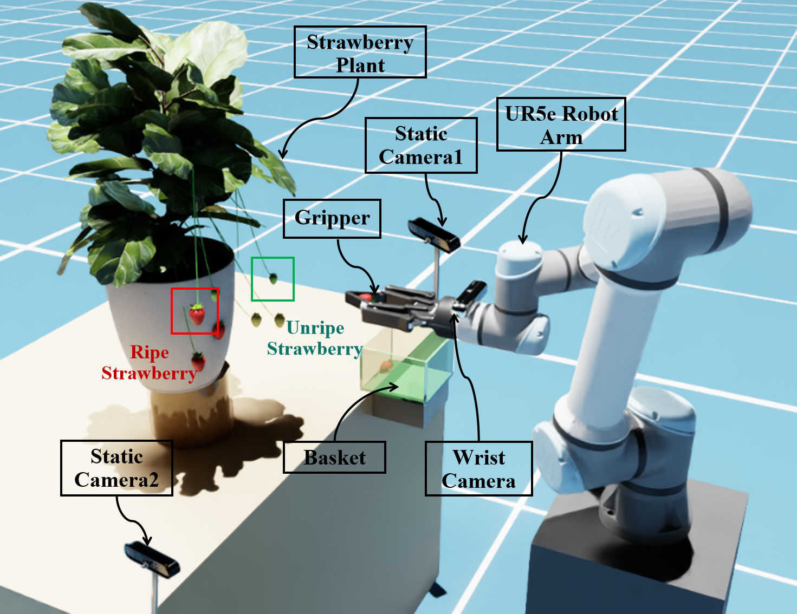
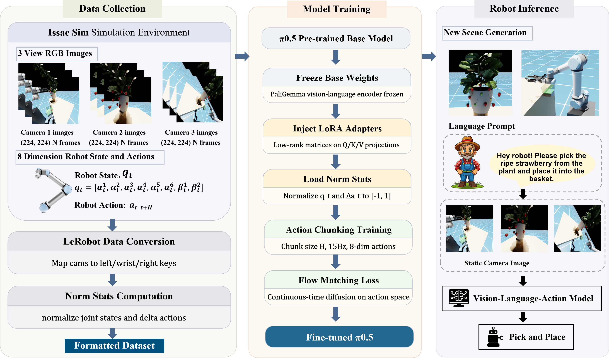
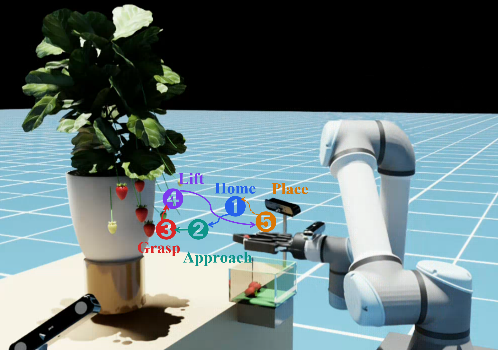
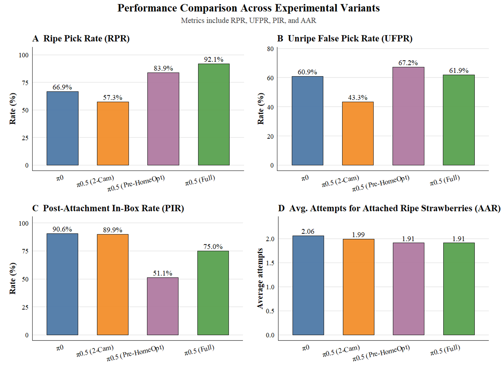
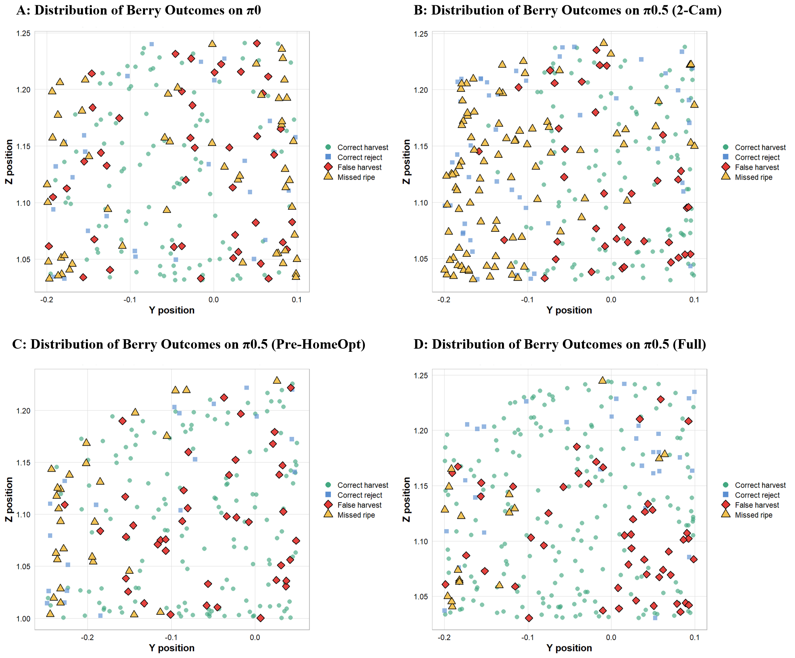

# Strawberry Harvesting with VLA in Isaac Sim

Fine-tuning [π₀ and π₀.₅](https://github.com/Physical-Intelligence/openpi) for selective strawberry harvesting with a UR5e arm in NVIDIA Isaac Sim — from procedural scene generation to closed-loop VLA inference.

<p align="center">
  
</p>

> Simulation environment: UR5e with Robotiq 2F-140 gripper, three RGB cameras (two static + one wrist-mounted), procedurally generated strawberry plant with ripe/unripe fruits, and collection basket.

---

## Demo

### Expert Controller
https://github.com/user-attachments/assets/60c53efd-194c-4f31-af66-0eee151e01ee

### π₀.₅ VLA Inference
https://github.com/user-attachments/assets/f19a6336-0c35-4865-96ca-c11055049aca

---

## Pipeline

<p align="center">
  
</p>

> End-to-end pipeline: expert demonstrations in Isaac Sim → LeRobot format conversion → LoRA fine-tuning of π₀.₅ → closed-loop inference in new scenes.

<p align="center">
  
</p>

> Five-stage expert routine: Home → Approach → Grasp → Lift → Place.

---

## Results

<p align="center">
  
</p>


| Variant | RPR ↑ | UFPR ↓ | PIR ↑ | AAR ↓ |
|---|---|---|---|---|
| π₀ | 66.9% | 60.9% | 90.6% | 2.06 |
| π₀.₅ (2-Cam) | 57.3% | 43.3% | 89.9% | 1.99 |
| π₀.₅ (Pre-HomeOpt) | 83.9% | 67.2% | 51.1% | 1.91 |
| π₀.₅ (Full) | **92.1%** | 61.9% | 75.0% | **1.91** |


<p align="center">
  
</p>

> Per-strawberry harvest outcomes projected onto the Y–Z plane across four variants.

---

## Environment

| Component | Version |
|---|---|
| OS | Ubuntu 22.04 (kernel 6.8.0) |
| GPU | NVIDIA RTX 4090 24 GB |
| Driver | 580.126.09 |
| Isaac Sim | 5.1.0 |
| Isaac Sim Python | 3.11.13 |
| openpi | commit [`54cbaee`](https://github.com/Physical-Intelligence/openpi/commit/54cbaee6ae0c010a1ed431871cdaa8f4684ac709) |
| openpi Python | 3.11.14 (via uv) |
| JAX | 0.5.3 |
| Flax | 0.10.2 |
| uv | 0.10.12 |

---

## Quick Start

### 1. Clone

```bash
git clone https://github.com/fanwu0806/strawberry_vla_pro.git
cd strawberry_vla_pro
```

### 2. Install Isaac Sim

Install [NVIDIA Isaac Sim 5.1.0](https://docs.omniverse.nvidia.com/isaacsim/latest/installation/install_workstation.html) and set the environment variable:

```bash
export ISAAC_SIM_DIR=/path/to/isaac-sim   # add to ~/.bashrc
```

### 3. Set up openpi

```bash
# Clone the pinned version
git clone https://github.com/Physical-Intelligence/openpi.git
cd openpi
git checkout 54cbaee6ae0c010a1ed431871cdaa8f4684ac709

# Install dependencies
curl -LsSf https://astral.sh/uv/install.sh | sh
uv sync
cd ..
```

### 4. Inject strawberry config into openpi

```bash
bash setup_openpi.sh
```

This automatically copies `strawberry_policy.py` and `convert_to_lerobot.py` into openpi, and patches `config.py` with the training configuration. The script is idempotent — safe to run multiple times.

### 5. Verify

```bash
cd openpi
uv run python -c "import openpi.training.config; print('OK')"
```

---

## Full Pipeline

The project uses two Python environments in two separate terminals:

| Terminal | Working directory | Python | Runs |
|---|---|---|---|
| **Isaac Sim** | `strawberry_vla_pro/` | `$ISAAC_SIM_DIR/python.sh` | data collection, inference |
| **openpi** | `strawberry_vla_pro/openpi/` | `uv run` | data conversion, training, policy server |

### Step 1: Collect Expert Demonstrations

```bash
# Launch 2 parallel headless workers (~3.8 GB VRAM each)
export ISAAC_SIM_DIR=/path/to/isaac-sim
cd data_collection
bash parallel_collect.sh 2

# Monitor progress
bash monitor.sh 2

# After completion, merge worker outputs
python3 merge_episodes.py
```

This produces `data_collection/episodes/` with HDF5 + image data.

### Step 2: Convert to LeRobot Format

```bash
cd openpi
uv run convert_to_lerobot.py \
    --data_dir ../data_collection/episodes \
    --only_success
```

Output goes to `~/.cache/huggingface/lerobot/local/strawberry_picking_3c/`.

### Step 3: Compute Normalization Statistics

```bash
uv run scripts/compute_norm_stats.py --config-name pi05_strawberry_3c
```

### Step 4: Train

```bash
XLA_PYTHON_CLIENT_MEM_FRACTION=0.9 uv run scripts/train.py \
    pi05_strawberry_3c \
    --exp-name=run1 \
    --overwrite \
    --save-interval=5000 \
    --keep-period=15000 \
    2>&1 | tee train.log
```

Training takes ~6 hours for 30k steps on a single RTX 4090 (batch size 4).

### Step 5: Inference

**Terminal 1 — Policy server (openpi):**

```bash
cd openpi
XLA_PYTHON_CLIENT_MEM_FRACTION=0.8 uv run scripts/serve_policy.py \
    policy:checkpoint \
    --policy.config=pi05_strawberry_3c \
    --policy.dir=checkpoints/pi05_strawberry_3c/run1/29999
```

**Terminal 2 — Isaac Sim:**

```bash
export ISAAC_SIM_DIR=/path/to/isaac-sim
$ISAAC_SIM_DIR/python.sh inference/strawberry_pick_vla_infer.py
```

---

## Pre-trained Checkpoints & Dataset

Skip data collection and training by downloading pre-trained weights and dataset from HuggingFace:

| Resource | Size | Link |
|---|---|---|
| π₀.₅ LoRA checkpoint | ~9.07 GB | [Fan0806/strawberry-vla-pi05-checkpoint](https://huggingface.co/Fan0806/strawberry-vla-pi05-checkpoint) |
| π₀ LoRA checkpoint | ~9.15 GB | [Fan0806/strawberry-vla-pi0-checkpoint](https://huggingface.co/Fan0806/strawberry-vla-pi0-checkpoint) |
| Training dataset (LeRobot) | ~10.0 GB | [Fan0806/strawberry-vla-dataset](https://huggingface.co/datasets/Fan0806/strawberry-vla-dataset) |

**Using a pre-trained checkpoint directly:**

```bash
# Download
huggingface-cli download Fan0806/strawberry-vla-pi05-checkpoint \
    --local-dir checkpoints/pi05

# Terminal 1 — Policy server:
cd openpi
XLA_PYTHON_CLIENT_MEM_FRACTION=0.8 uv run scripts/serve_policy.py \
    policy:checkpoint \
    --policy.config=pi05_strawberry_3c \
    --policy.dir=../checkpoints/pi05

# Terminal 2 — Isaac Sim:
export ISAAC_SIM_DIR=/path/to/isaac-sim
$ISAAC_SIM_DIR/python.sh inference/strawberry_pick_vla_infer.py
```

---

## Repository Structure

```
strawberry_vla_pro/
├── README.md
├── .env.example
├── .gitignore
├── setup_openpi.sh                      # One-time openpi configuration
│
├── expert/
│   └── strawberry_pick_expert.py        # RMPFlow expert controller
│
├── data_collection/
│   ├── strawberry_pick_vla_collect.py   # Expert with 3-cam recording (15Hz)
│   ├── vla_data_collector.py            # EpisodeRecorder module
│   ├── parallel_collect.sh              # Multi-worker launcher
│   ├── merge_episodes.py               # Combine worker outputs
│   └── monitor.sh                       # Real-time progress monitor
│
├── data_conversion/
│   └── convert_to_lerobot.py           # HDF5 → LeRobot v2 format
│
├── training/
│   ├── strawberry_policy.py            # Input/output transforms for openpi
│   └── config_snippet.py              # Reference: DataConfig + TrainConfig
│
├── inference/
│   └── strawberry_pick_vla_infer.py    # Multi-scene evaluation
│
├── scene/
│   └── scene_assembled_manual.usd      # Isaac Sim USD scene
│
├── plant/                              # Ficus plant model + textures
│   ├── ficus_obj.usd
│   ├── ficus_obj.obj / .mtl
│   └── *.jpg / *.tga
│
├── strawberry/
│   └── Strawberry_gltf.gltf           # Strawberry 3D model
│
├── assets/
│   ├── figures/                        # Paper figures (fig1–fig5)
│   └── pi05_strawberry/               # Normalization statistics
│
└── openpi/                             # ← git clone (not tracked)
```

---

## How `setup_openpi.sh` Works

The setup script bridges this repository with the openpi framework by:

1. **Copying** `training/strawberry_policy.py` → `openpi/src/openpi/policies/`
2. **Copying** `data_conversion/convert_to_lerobot.py` → `openpi/`
3. **Patching** `openpi/src/openpi/training/config.py`:
   - Adds `import openpi.policies.strawberry_policy`
   - Adds `LeRobotStrawberryDataConfig` class (3-camera repack + delta actions)
   - Adds `pi05_strawberry_3c` TrainConfig (LoRA fine-tuning, batch=4, 30k steps)
4. **Copying** normalization statistics → `openpi/assets/`

The script is idempotent: running it again safely skips already-applied changes.

---

## Evaluation Metrics

| Metric | Description | Direction |
|---|---|---|
| **RPR** (Ripe Pick Rate) | Fraction of ripe strawberries successfully attached | ↑ higher is better |
| **UFPR** (Unripe False Pick Rate) | Fraction of unripe strawberries mistakenly attached | ↓ lower is better |
| **PIR** (Post-Attachment In-Box Rate) | Placement success rate after attachment | ↑ higher is better |
| **AAR** (Avg Attempts per Attached Ripe) | Operational efficiency per successful pick | ↓ lower is better |


## Acknowledgments

[Physical Intelligence](https://www.physicalintelligence.company/) (π₀ / π₀.₅ / openpi) · [LeRobot](https://github.com/huggingface/lerobot) · [NVIDIA Isaac Sim](https://developer.nvidia.com/isaac-sim) 
